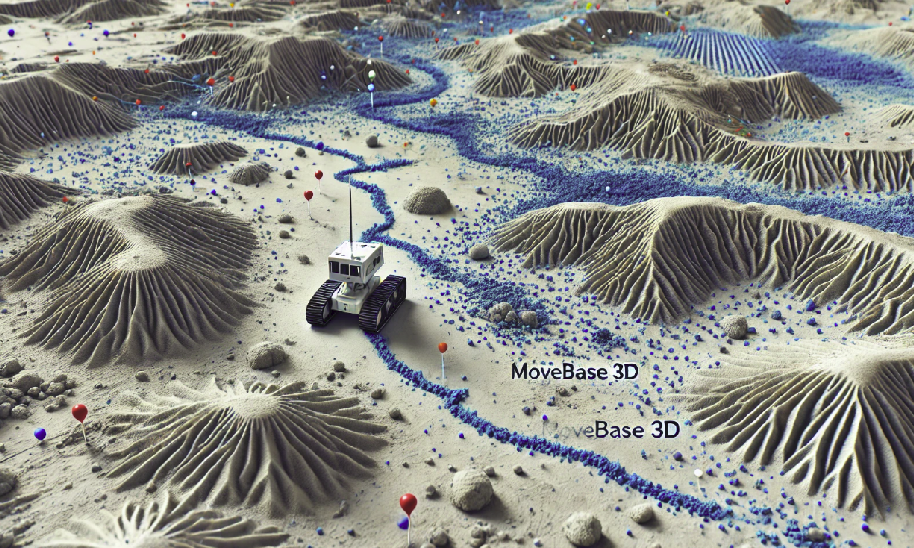
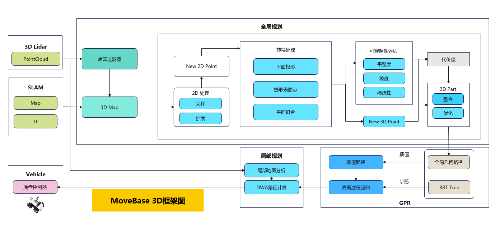
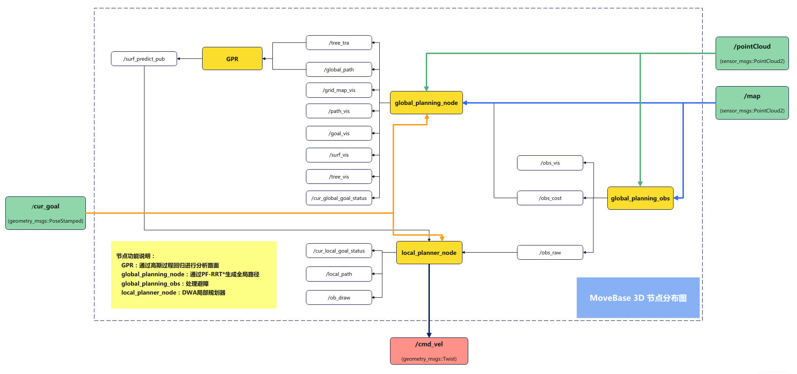
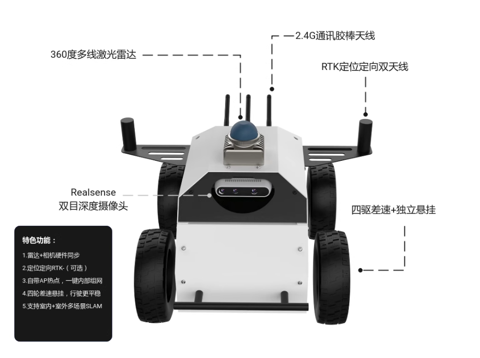
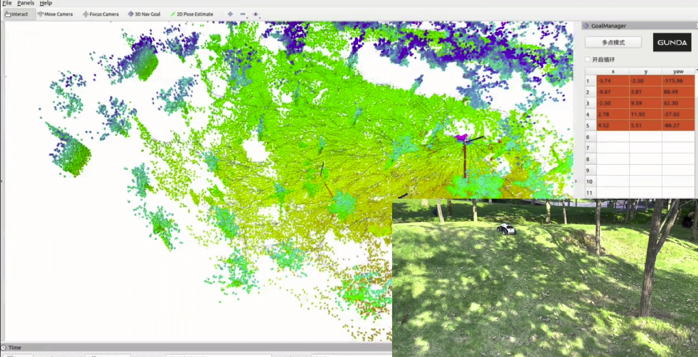

# MoveBase3D
MoveBase3D is a plane-fitting based uneven terrain navigation framework, which allows UGV to traverse different kinds of unstructured and complex environments outdoors.



 **MoveBase 3D** :基于3D点云平面拟合，适用于非结构化路面的导航框架，区别于ROS1中的Movebase 2D框架，帮助室内外，尤其是室外自主无人车穿越非平坦路面，帮助实现无人车翻山越岭，从此一马平川。

     说明：犹如其名，这里仅包含运动规划部分，建图和定位模块需要外置SLAM框架

该框架整合了3D Grid Map和3D导航规划器（RRT），从而使UGV脱离2D导航的约束，提升其对不同场景下地面和地势的适应性

 **仅供科研测试使用，请勿商用** 

整体功能框架图：



实际效果可以查看 [B站视频链接](https://www.bilibili.com/video/BV1n5qKYEE3Y/?vd_source=3d1b3e9650faa4e5ad34e91177c87105)

### 使用说明：

硬件要求：11代NUC-i7或以上

系统要求：Ubuntu20.04、Ubuntu18.04

ROS要求：ROS1 （melodic或noetic）

SLAM要求：FastLio2、A-LOAM等常见的3D激光雷达SLAM框架

**（建议：所选的SLAM框架先要在ROS自带的movebase中跑通，再切换到MoveBase3D框架，以避免兼容问题）**

#### 第一步：

安装和部署SLAM框架，建议选用自己熟悉的框架

#### 第二步：

安装依赖库

2.1 molodic版本：

```
sudo apt-get install ros-melodic-ompl
sudo apt-get install ros-melodic-robot-state-publisher*
sudo apt-get install ros-melodic-joint-state-controller*
sudo apt-get install ros-melodic-controller*
sudo apt-get install ros-melodic-velocity-controllers*
sudo apt-get install ros-melodic-eigen*
sudo apt-get install ros-melodic-rviz-visual-tools
pip install casadi
```

2.2 noetic版本：

```
sudo apt-get install ros-noetic-ompl
sudo apt-get install ros-noetic-robot-state-publisher*
sudo apt-get install ros-noetic-joint-state-controller*
sudo apt-get install ros-noetic-controller*
sudo apt-get install ros-noetic-velocity-controllers*
sudo apt-get install ros-noetic-eigen*
sudo apt-get install ros-noetic-rviz-visual-tools
pip install casadi
```
#### 第三步：

克隆代码库和编译


```
mkdir -p catkin_ws/src
cd catkin_ws/src/
catkin_init_workspace
git clone https://github.com/WilsonGuo/MoveBase3D.git
cd ..

catkin_make
```


#### 第四步：

设置权限

```
cd catkin_ws/src/rover_slam/local_planner_3d/scripts/
sudo chmod a+x *
```

### 具体介绍

节点框架图：



使用车辆说明：



该框架下，该版本代码暂无融合RTK，后续版本会添加该功能

必要Topic说明：

| 名称         | 格式                        | 功能     | 说明          |
|------------|---------------------------|--------|-------------|
| pointCloud | sensor_msgs/PointCloud2   | 实时点云数据 | 订阅：3D雷达发布   |
| map        | sensor_msgs/PointCloud2   | 点云地图   | 订阅：SLAM发布   |
| cur_goal   | geometry_msgs/PoseStamped | 目标位姿   | 订阅：rviz插件发布 |
| cmd_vel    | geometry_msgs/Twist       | 控制速度指令 | 发布：底盘控制器接收  |

对外订阅和发布关系：

 **global_planning_node和global_planning_obs：** 

      订阅pointCloud、map、cur_goal话题

 **local_plannning_node:** 

      发布cmd_vel
（内部订阅和发布关系请参照上方--节点功能图）

**核心节点功能说明：** 
     
     global_planning_node：通过PF-RRT*生成全局路径
     global_planning_obs：处理避障
     GPR：通过高斯过程回归进行分析路面
     local_planner_node：DWA局部规划器

参数说明：
配置文件所在目录：/global_planner_3d/config/move_base_3d/

 **a.move_base_global_obs.yaml**
 
参数：

```
map:
  map_frame_id: map               # 地图坐标系名称
  lidar_frame_id: livox_frame     # 雷达坐标系名称
  base_frame_id: base_footprint   # 底盘坐标系名称
  resolution: 0.1   
  # 表示地图的分辨率（单位：米），这里设置为0.1米。每个栅格单元代表0.1米的区域。分辨率越高（值越小），地图越精细，但计算负担更大。
  expansionCoefficient: 2.0       # 障碍物扩展系数
  leaf_size: 0.2                  # 降采样参数
  local_x_l: -2.0                 # 点云过滤边界 X轴最小值
  local_x_u: 2.0                  # 点云过滤边界 X轴最大值
  local_y_l: -1.5
  local_y_u: 1.5
  local_z_l: -0.5  
  local_z_u: 1.5    

```

 **b.move_base_global.yaml** 

参数：


```
map:
  resolution: 0.1           # 表示地图的分辨率（单位：米），这里设置为0.1米。
  expansionCoefficient: 1.0 # 障碍物扩展系数
  map_x_l: -40.0
  map_x_u: 40.0       # map_x_l和map_x_u分别表示地图在x轴方向的下界和上界。
  map_y_l: -40.0
  map_y_u: 40.0       # 类似地，map_y_l和map_y_u表示地图在y轴方向的下界和上界。


planning: 
  step_size: 0.4      # 表示路径规划中的步长或采样间隔。步长越大，路径节点之间的距离越远，计算速度会提高，但路径的精度可能会降低。
  h_surf_car: 0.7     # 表示规划中的表面高度与车辆底盘的距离，这个高度通常用于确定可行驶区域或进行避障规划，确保路径适应车辆的底盘高度。
  goal_thre: 0.5      # 判断是否到达目标点
  neighbor_radius: 1.0  #临近点半径
  w_fit_plane: 1.0    # 平面拟合的权重系数，影响路径规划过程中平面拟合的重要性。值越高，对平面拟合的偏好越强。
  w_flatness: 1000.0  # 平坦度的权重系数，表示对路径平坦度的偏好。值越大，越倾向于选择较平坦的路径，避免选择陡峭或不平的地形。
  w_slope: 0.1        # 坡度权重，表示路径规划过程中对坡度的偏好。值越小，越倾向于选择低坡度的路径，以便更安全地行驶。
  w_sparsity: 1.0     # 稀疏性的权重系数，控制路径中点的密集度。稀疏度高的路径点数会减少，但路径可能不够平滑。

  ratio_max: 0.05
  ratio_min: 0.02
  conv_thre: 0.1152     #收敛阈值，用于路径规划中的收敛判定，表示在优化或迭代过程中当变化小于此值时认为路径已收敛到最优。

  radius_fit_plane: 0.5 #平面拟合的半径，用于确定平面拟合的范围。半径越大，拟合的平面区域越广，适合大范围平面识别。
  max_initial_time: 1000
```

这些参数结合起来用于定义地图大小和路径规划规则，帮助规划一个符合车辆行驶要求的路径，同时确保路径平坦、安全和高效。

 **c.move_base_local.yaml** 

参数：


```
map_frame_id: /map
base_frame_id: /base_footprint
replan_period: 0.1              # 路径规划周期：0.1即：10hz
cmd_period: 0.1                 # cmd_vel发布周期
state_period: 0.1               # 当前位姿查询周期
reached_position_tolerance: 0.2 # 到达目标点的位置容差
reached_yaw_tolerance: 0.15     # 到达目标点的角度容差
goal_min_angular_speed: -0.4    # 到达目标点后，调整角度的最小角速度值
goal_max_angular_speed: 0.4     # 到达目标点后，调整角度的最大角速度值
goal_angular_gain: 2.0          # 到达目标点后，调整角度的角速度的增益值，避免过冲所造成的的左右震荡

```


### 具体启动步骤


1.启动底盘及其传感器相关节点

2.启动你的slam节点
 （需要提前预置3D点云地图，即提前建图生成点云地图文件）

3.启动movebase 3D及其相关节点

```
   roslaunch rover_launch move_base_3d.launch

```
4.在rviz中设置起始点位姿和目标点位姿
（本框架附带了一个具备简单的多点导航功能rviz插件）
设置初始位姿或目标位姿的时候，建议不要设置在无点云，或者过于稀疏的区域，容易引发全局规划器无法投射有效位姿

5.观察车辆运动
可以加载rviz配置项：/rover_launch/rviz_config/nav.rviz
来选择可视化界面，这里可能有些topic需要根据你自己的slam框架修改




----

 **备注：** 

该框架参考PUTN，[链接地址](https://github.com/jianzhuozhuTHU/putn)
论文参照，[论文地址](https://arxiv.org/pdf/2203.04541.pdf)

 **联系：** 

 

